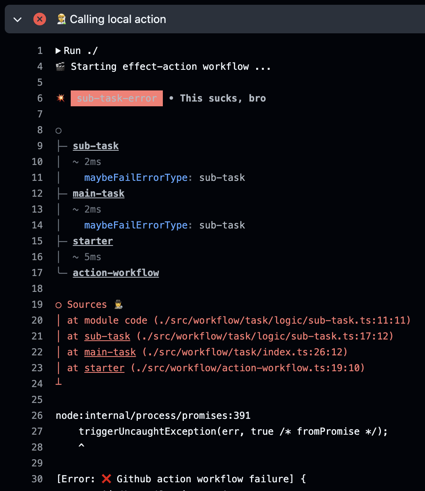

# effect-action

[](https://github.dev/jpb06/effect-action)

A template to create a github action using [Effect](https://effect.website/) and [effect-errors](https://github.com/jpb06/effect-errors).

<!-- readme-package-icons start -->

<p align="left"><a href="https://docs.github.com/en/actions" target="_blank"></a>&nbsp;<a href="https://www.typescriptlang.org/docs/" target="_blank"></a>&nbsp;<a href="https://nodejs.org/en/docs/" target="_blank"></a>&nbsp;<a href="https://bun.sh/docs" target="_blank"></a>&nbsp;<a href="https://biomejs.dev/guides/getting-started/" target="_blank"></a>&nbsp;<a href="https://esbuild.github.io/getting-started/#install-esbuild" target="_blank"></a>&nbsp;<a href="https://www.effect.website/docs/quickstart" target="_blank"></a></p>

<!-- readme-package-icons end -->

## ⚡ Output



You can take a look at the three sample workflows:

- [Success](https://github.com/jpb06/effect-action/actions/workflows/success.yml).
- [Main task failure](https://github.com/jpb06/effect-action/actions/workflows/main-task-failure.yml).
- [Sub task failure](https://github.com/jpb06/effect-action/actions/workflows/sub-task-failure.yml).

## ⚡ Usage

To pretty print the error and display a stack trace that is actually useful, we must collect the `cause` using `Effect.catchAll` and use `captureErrors` from [effect-errors](https://github.com/jpb06/effect-errors).

This function will use source maps if present to resolve sources location. We can then use `prettyPrintFromCapturedErrors` function to display the error details.

```ts
import { setFailed } from '@actions/core';
import { FetchHttpClient } from '@effect/platform';
import { NodeFileSystem } from '@effect/platform-node';
import { Effect, Layer, pipe } from 'effect';
import { captureErrors, prettyPrintFromCapturedErrors } from 'effect-errors';
import type { Cause } from 'effect/Cause';

const collectErrorDetails = <E>(cause: Cause<E>) =>
  pipe(
    Effect.gen(function* () {
      const captured = yield* captureErrors(cause, {
        reverseSpans: true,
        stripCwd: true,
      });
      const message = prettyPrintFromCapturedErrors(captured, {
        hideStackTrace: true,
        stripCwd: true,
        reverseSpans: true,
      });

      console.error(message);

      setFailed('❌ Github action workflow failure');
    }),
    Effect.scoped,
    Effect.provide(Layer.mergeAll(FetchHttpClient.layer, NodeFileSystem.layer)),
    Effect.withSpan('collect-error-details')
  );

export const actionWorkflow = Effect.runPromise(
  pipe(
    starter,
    Effect.sandbox,
    Effect.catchAll(collectErrorDetails),
    Effect.provide(LoggerConsoleLive),
    Effect.withSpan('action-workflow')
  )
);
```
